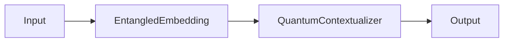

# Documentation

This directory contains comprehensive documentation for the Entanglement-Enhanced NLP framework.

## 📚 Documentation Structure

- **[index.md](index.md)**: Overview and introduction to the framework
- **[installation.md](installation.md)**: Installation instructions and system requirements
- **[usage.md](usage.md)**: Comprehensive usage guide with examples
- **[api.md](api.md)**: Complete API reference documentation
- **[theory.md](theory.md)**: Quantum NLP theory and mathematical foundations
- **[architecture.md](architecture.md)**: System architecture and design principles
- **[cli.md](cli.md)**: Command-line interface documentation
- **[examples.md](examples.md)**: Practical examples and tutorials

## 🚀 Building the Documentation

### Prerequisites

Install MkDocs and required extensions:

```bash
pip install mkdocs mkdocs-material pymdown-extensions
```

### Local Development

Serve the documentation locally with auto-reload:

```bash
# From the project root directory
mkdocs serve
```

The documentation will be available at `http://localhost:8000`

### Building Static Site

Build the documentation for deployment:

```bash
mkdocs build
```

The static site will be generated in the `site/` directory.

### Deploying to GitHub Pages

Deploy directly to GitHub Pages:

```bash
mkdocs gh-deploy
```

## 🎨 Documentation Features

### Mathematical Notation

The documentation supports LaTeX mathematical notation via MathJax:

**Inline math**: `$E = mc^2$` renders as $E = mc^2$

**Display math**:
```latex
$$|\psi\rangle = \alpha|0\rangle + \beta|1\rangle$$
```

### Code Highlighting

Syntax highlighting for multiple languages:

```python
from entanglement_enhanced_nlp import EntangledEmbedding
embedder = EntangledEmbedding(vocab_size=1000, embedding_dim=768)
```

### Diagrams

Mermaid diagrams for architecture visualization:



### Admonitions

Information blocks for important notes:

!!! note "Important"
    This framework provides classical simulations of quantum-inspired mechanisms.

!!! warning "Performance"
    Large correlation matrices may require significant memory.

!!! tip "Optimization"
    Use sparse correlation computation for better performance.

## 📝 Contributing to Documentation

### Style Guidelines

1. **Headers**: Use descriptive headers with emoji indicators
2. **Code blocks**: Always specify language for syntax highlighting
3. **Examples**: Provide complete, runnable code examples
4. **Links**: Use relative links between documentation pages
5. **Math**: Use LaTeX notation for mathematical expressions

### Documentation Sections

**Overview sections should include**:
- Brief description of the concept
- Key benefits and use cases
- Simple code example

**Reference sections should include**:
- Complete function/class signatures
- Parameter descriptions with types
- Return value descriptions
- Usage examples
- Related functions/classes

**Tutorial sections should include**:
- Step-by-step instructions
- Complete working examples
- Common pitfalls and solutions
- Performance considerations

### Adding New Documentation

1. Create new `.md` file in appropriate directory
2. Add entry to `mkdocs.yml` navigation
3. Follow existing style and formatting conventions
4. Include relevant examples and code snippets
5. Test locally with `mkdocs serve`

## 🔧 Configuration

The documentation is configured via `mkdocs.yml` in the project root:

- **Theme**: Material for MkDocs with custom color scheme
- **Extensions**: Includes code highlighting, math support, and diagrams
- **Navigation**: Organized by user journey (Getting Started → Documentation → Theory)
- **Features**: Search, navigation tabs, code copy buttons

## 📊 Documentation Metrics

Track documentation quality and completeness:

- **Coverage**: All public APIs documented
- **Examples**: Every major feature has usage examples
- **Accuracy**: Regular testing of code examples
- **Accessibility**: Clear language and proper heading structure

## 🐛 Troubleshooting

### Common Issues

**MathJax not rendering**:
- Check `mathjax.js` configuration
- Verify `pymdownx.arithmatex` extension is enabled

**Code highlighting not working**:
- Ensure language is specified in code blocks
- Check `pymdownx.highlight` extension configuration

**Mermaid diagrams not displaying**:
- Verify `pymdownx.superfences` with mermaid support
- Check diagram syntax for errors

**Local serve fails**:
- Install missing dependencies: `pip install mkdocs-material`
- Check `mkdocs.yml` for syntax errors

### Getting Help

- Check MkDocs documentation: https://www.mkdocs.org/
- Material theme docs: https://squidfunk.github.io/mkdocs-material/
- PyMdown Extensions: https://facelessuser.github.io/pymdown-extensions/

## 📄 License

Documentation is part of the Entanglement-Enhanced NLP project and follows the same MIT license.
