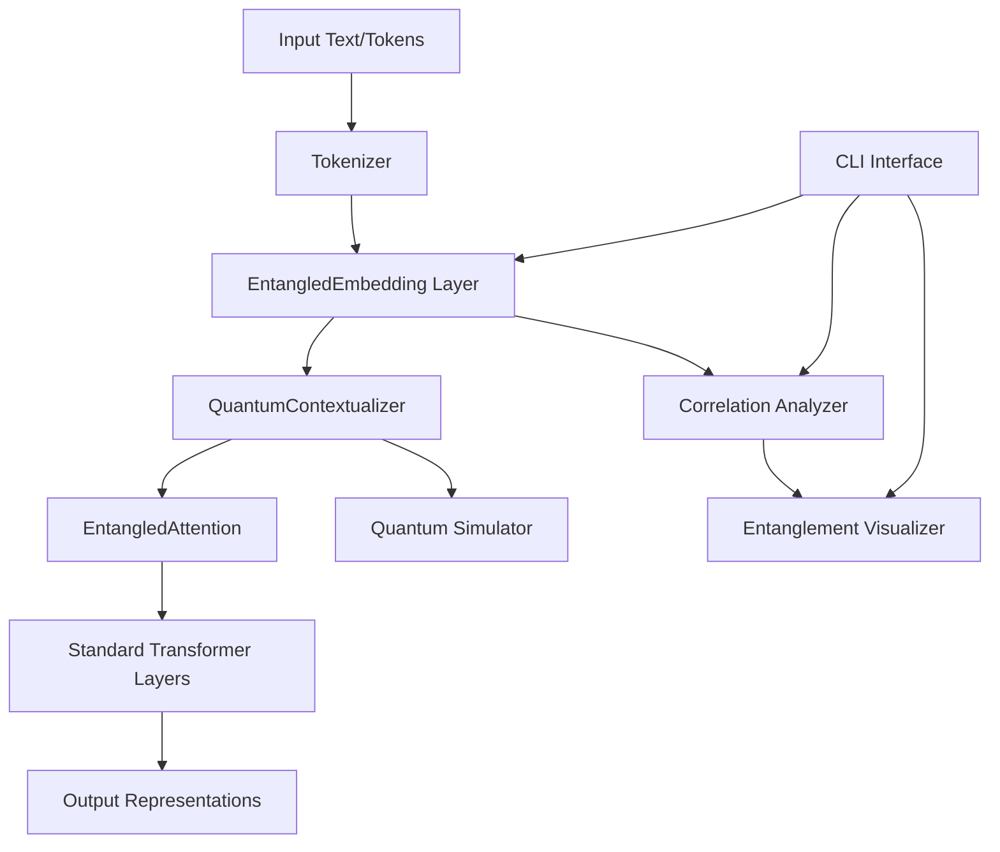
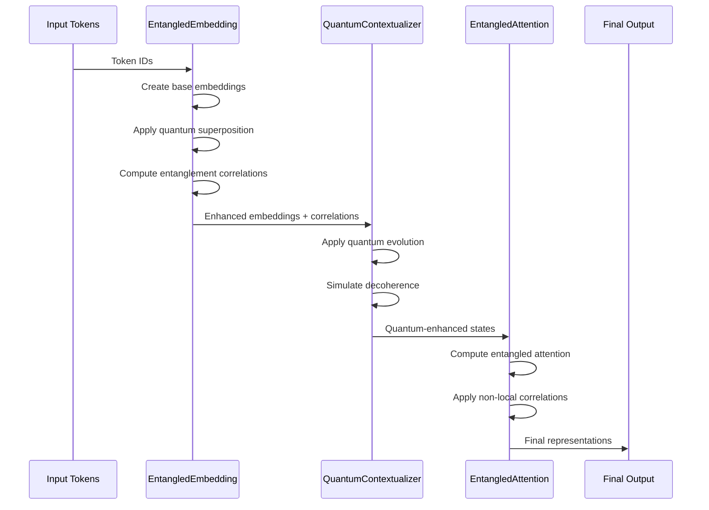
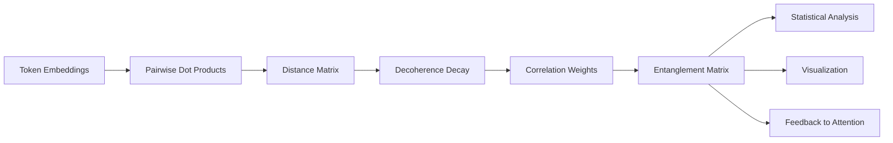
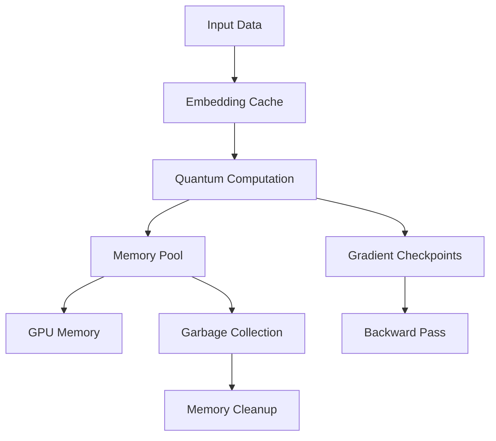

# System Architecture

This document provides a comprehensive overview of the Entanglement-Enhanced NLP framework architecture, including component interactions, data flow, and design principles.

## 🏗 High-Level Architecture

The framework follows a modular design with clear separation of concerns:



## 🔧 Core Components

### 1. Embedding Layer (`entangled_embedding.py`)

**Purpose**: Primary entry point that converts tokens to quantum-enhanced embeddings

**Key Responsibilities**:

- Token-to-embedding conversion with quantum superposition
- Entanglement correlation computation
- Positional encoding integration
- Decoherence effect simulation

**Architecture**:

```python
class EntangledEmbedding(nn.Module):
    ├── base_embedding: nn.Embedding
    ├── quantum_amplitudes: nn.Parameter
    ├── entanglement_matrix: nn.Parameter
    ├── evolution_operators: nn.ParameterList
    └── position_encoding: torch.Tensor
```

**Data Flow**:

```mermaid
Input Tokens → Base Embeddings → Quantum Superposition → 
Entanglement Application → Position Encoding → Output Embeddings
```

### 2. Quantum Contextualizer (`quantum_contextualizer.py`)

**Purpose**: Applies quantum state evolution to enhance contextual understanding

**Key Responsibilities**:

- Quantum state evolution simulation
- Decoherence modeling
- Measurement simulation
- Context enhancement through quantum dynamics

**Architecture**:

```python
class QuantumContextualizer(nn.Module):
    ├── hamiltonian_matrices: nn.ParameterList
    ├── measurement_operators: nn.ParameterList
    ├── evolution_layers: nn.ModuleList
    └── decoherence_simulator: nn.Module
```

### 3. Entangled Attention (`entangled_attention.py`)

**Purpose**: Multi-head attention mechanism enhanced with quantum correlations

**Key Responsibilities**:

- Standard multi-head attention computation
- Quantum correlation integration
- Non-local attention effects
- Entanglement-aware weight computation

**Architecture**:

```python
class EntangledAttention(nn.Module):
    ├── standard_attention: nn.MultiheadAttention
    ├── quantum_correlation_layer: nn.Linear
    ├── entanglement_projector: nn.Linear
    └── correlation_mixer: nn.Module
```

## 🔄 Component Interactions

### Forward Pass Data Flow



### Correlation Computation Pipeline



## 📊 Analysis and Visualization Components

### Correlation Analyzer (`correlation_analyzer.py`)

**Purpose**: Analyze and quantify entanglement patterns

**Components**:

```python
class CorrelationAnalyzer:
    ├── mutual_information_calculator
    ├── entanglement_entropy_computer
    ├── distance_decay_analyzer
    └── statistical_significance_tester
```

### Entanglement Visualizer (`entanglement_visualizer.py`)

**Purpose**: Create visual representations of quantum correlations

**Components**:

```python
class EntanglementVisualizer:
    ├── heatmap_generator
    ├── network_graph_creator
    ├── evolution_tracker
    └── 3d_quantum_state_plotter
```

## 🛠 Utility Layer

### Quantum Simulator (`quantum_simulator.py`)

**Purpose**: Backend simulation of quantum-like operations

**Components**:

```python
class QuantumSimulator:
    ├── state_vector_simulator
    ├── gate_operation_engine
    ├── measurement_simulator
    └── noise_model
```

**Supported Operations**:

- Quantum gate applications (Hadamard, CNOT, Rotation)
- State evolution under Hamiltonians
- Quantum measurement simulation
- Decoherence and noise modeling

## 🔌 Integration Layer

### HuggingFace Integration (`entangled_transformer.py`)

**Purpose**: Seamless integration with existing transformer models

**Architecture**:

```python
class EntangledTransformer(nn.Module):
    ├── base_transformer: PreTrainedModel
    ├── entanglement_injector: EntanglementInjector
    ├── layer_wrapper: LayerWrapper
    └── output_processor: OutputProcessor
```

**Integration Strategy**:

1. **Wrapper Approach**: Wraps existing models without modification
2. **Layer Injection**: Inserts entanglement layers at specified positions
3. **Gradient Flow**: Maintains proper gradient flow through all components
4. **State Management**: Preserves model state and configuration

### Plugin System

```python
class EntanglementPlugin:
    """Base class for entanglement plugins."""
    
    def register_hooks(self, model):
        """Register forward/backward hooks."""
    
    def process_embeddings(self, embeddings):
        """Process embeddings with quantum effects."""
    
    def extract_correlations(self):
        """Extract entanglement correlations."""
```

## 🎛 Configuration Management

### Configuration Architecture

```python
@dataclass
class ArchitectureConfig:
    # Core component settings
    embedding_config: EntanglementConfig
    contextualizer_config: QuantumConfig
    attention_config: AttentionConfig
    
    # Integration settings
    transformer_integration: bool = True
    plugin_system_enabled: bool = True
    
    # Performance settings
    use_gradient_checkpointing: bool = False
    mixed_precision: bool = True
    correlation_computation: str = "sparse"  # "full", "sparse", "approximate"
```

### Dynamic Configuration

The framework supports runtime configuration changes:

```python
# Dynamic parameter adjustment
embedder.update_correlation_strength(0.9)
contextualizer.set_evolution_steps(10)
attention.configure_entanglement_mode("strong")
```

## 🚀 Performance Architecture

### Memory Management



### Computational Optimization

**Sparse Correlation Computation**:

```python
def sparse_correlation_compute(embeddings, threshold=0.1):
    """
    Compute only significant correlations above threshold.
    Reduces O(n²) to O(k*n) where k << n.
    """
    correlations = compute_full_correlations(embeddings)
    sparse_mask = torch.abs(correlations) > threshold
    return correlations * sparse_mask
```

**Low-Rank Approximation**:

```python
def low_rank_evolution(embeddings, rank=32):
    """
    Approximate quantum evolution with low-rank matrices.
    Reduces O(d²) to O(r*d) where r << d.
    """
    U, S, V = torch.svd(evolution_matrix)
    U_r, S_r, V_r = U[:, :rank], S[:rank], V[:, :rank]
    approx_evolution = U_r @ torch.diag(S_r) @ V_r.T
    return torch.matmul(embeddings, approx_evolution)
```

## 🔄 Data Flow Patterns

### Batch Processing Architecture

```python
class BatchProcessor:
    """Efficient batch processing for quantum operations."""
    
    def process_batch(self, batch_data):
        # 1. Tokenization and initial embedding
        embeddings = self.embed_tokens(batch_data)
        
        # 2. Quantum correlation computation (parallelized)
        correlations = self.compute_correlations_parallel(embeddings)
        
        # 3. Evolution application (vectorized)
        evolved_states = self.apply_evolution_vectorized(embeddings)
        
        # 4. Attention computation with quantum enhancement
        attended_states = self.entangled_attention(evolved_states, correlations)
        
        return attended_states, correlations
```

### Streaming Architecture

For large documents or real-time processing:

```python
class StreamingProcessor:
    """Process text streams with quantum enhancement."""
    
    def __init__(self, window_size=512, overlap=64):
        self.window_size = window_size
        self.overlap = overlap
        self.correlation_buffer = {}
    
    def process_stream(self, text_stream):
        for window in self.sliding_window(text_stream):
            # Process current window
            embeddings, correlations = self.process_window(window)
            
            # Update correlation buffer for context continuity
            self.update_correlation_buffer(correlations)
            
            yield embeddings
```

## 🔧 Extensibility Design

### Plugin Architecture

```python
class PluginManager:
    """Manage quantum enhancement plugins."""
    
    def __init__(self):
        self.plugins = {}
        self.hooks = defaultdict(list)
    
    def register_plugin(self, name: str, plugin: EntanglementPlugin):
        """Register a new quantum enhancement plugin."""
        self.plugins[name] = plugin
        plugin.register_hooks(self)
    
    def apply_plugins(self, stage: str, data: torch.Tensor):
        """Apply all registered plugins for a given processing stage."""
        for hook in self.hooks[stage]:
            data = hook(data)
        return data
```

### Custom Quantum Operations

```python
class CustomQuantumOperation(nn.Module):
    """Base class for custom quantum-inspired operations."""
    
    def __init__(self, operation_type: str):
        super().__init__()
        self.operation_type = operation_type
    
    def quantum_transform(self, embeddings: torch.Tensor) -> torch.Tensor:
        """Apply custom quantum transformation."""
        raise NotImplementedError
    
    def register_with_framework(self, framework):
        """Register operation with the main framework."""
        framework.register_custom_operation(self)
```

## 📈 Scalability Considerations

### Horizontal Scaling

```python
class DistributedQuantumProcessor:
    """Distributed processing for large-scale quantum NLP."""
    
    def __init__(self, num_workers: int):
        self.num_workers = num_workers
        self.worker_pool = self.initialize_workers()
    
    def distributed_correlation_compute(self, embeddings):
        """Distribute correlation computation across workers."""
        chunks = torch.chunk(embeddings, self.num_workers, dim=0)
        futures = []
        
        for chunk in chunks:
            future = self.worker_pool.submit(self.compute_chunk_correlations, chunk)
            futures.append(future)
        
        results = [future.result() for future in futures]
        return torch.cat(results, dim=0)
```

### Vertical Scaling

- **GPU Acceleration**: CUDA kernels for quantum operations
- **Memory Optimization**: Smart caching and memory pooling
- **Computation Graphs**: Optimized execution graphs for quantum circuits

## 🔒 Error Handling and Robustness

### Error Recovery Architecture

```python
class QuantumErrorHandler:
    """Handle errors in quantum computations gracefully."""
    
    def __init__(self):
        self.fallback_strategies = {
            'correlation_failure': self.classical_correlation_fallback,
            'evolution_failure': self.identity_evolution_fallback,
            'measurement_failure': self.random_measurement_fallback
        }
    
    def handle_quantum_error(self, error_type: str, context: dict):
        """Apply appropriate fallback strategy."""
        fallback = self.fallback_strategies.get(error_type)
        if fallback:
            return fallback(context)
        else:
            raise QuantumProcessingError(f"No fallback for {error_type}")
```

### Validation and Testing Architecture

```python
class QuantumValidator:
    """Validate quantum operations and results."""
    
    def validate_entanglement_properties(self, correlations):
        """Ensure correlations satisfy quantum constraints."""
        # Check unitarity, hermiticity, etc.
        pass
    
    def validate_evolution_consistency(self, initial_state, final_state):
        """Validate quantum evolution preserves required properties."""
        # Check norm preservation, entropy bounds, etc.
        pass
```

This architecture provides a robust, scalable, and extensible foundation for quantum-inspired natural language processing, enabling researchers and developers to explore novel quantum-classical hybrid approaches while maintaining practical usability and performance.
